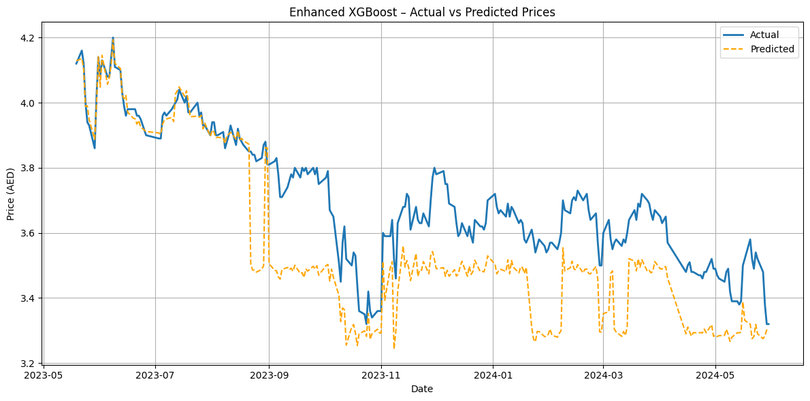
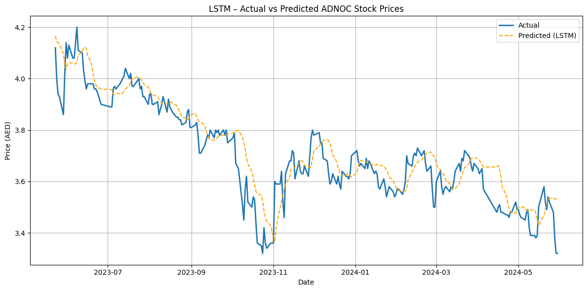

# Forecasting ADNOC Stock Prices using XGBoost and LSTM

## Purpose

This project aims to build and compare machine learning and deep learning models for forecasting ADNOC stock price movements. The goal is to evaluate which method performs better under real-world conditions and to offer transparent, data-driven insights for financial planning, trading, or operational decision-making within the oil and gas industry.

## About ADNOC

The Abu Dhabi National Oil Company (ADNOC) is one of the world's largest and most influential energy producers, playing a central role in the UAE’s economy. ADNOC operates across the entire hydrocarbon value chain—from exploration and production to refining and petrochemicals. Accurate forecasting of ADNOC's financial performance, especially stock trends, is critical for investors, analysts, and economic planners navigating a complex and volatile energy market.

---

## 📁 Project Structure

```
XGBoost_vs_LSTM_ADNOC_Forecasting/
│
├── notebooks/          # Jupyter notebooks with code and results
├── data/               # Input data files (e.g., .csv)
├── plots/              # Visualizations: predictions, trends, SHAP
├── models/             # Trained model files (.h5 for LSTM, .pkl for XGBoost)
└── README.md           # Project documentation
```

---

## 🔍 Models Compared

### XGBoost
A gradient boosting tree model known for its speed and performance on structured data. It includes built-in regularization and supports model interpretability via SHAP.

### LSTM (Long Short-Term Memory)
A recurrent neural network architecture ideal for time series forecasting. LSTM excels at learning sequential dependencies and financial market rhythms.

---

## ✅ Key Features

- Data normalization and feature engineering
- Sequence construction for LSTM
- Train-test split and time series validation
- Model evaluation using RMSE, MAE, R², and MAPE
- SHAP explainability for XGBoost
- Visual comparison of model outputs

---

## 📊 Visual Insights

### Daily Price Volatility Distribution


### XGBoost – Actual vs Predicted Prices


### LSTM – Actual vs Predicted Prices


These visualizations reveal each model’s ability to learn patterns, trends, and fluctuations in ADNOC’s stock performance.

---

## 🛠️ How to Run

1. Place your time series data (CSV) inside the `data/` directory.
2. Open the Jupyter notebook in `notebooks/` and run all cells.
3. Visuals and metrics will be generated in the `plots/` directory.

### Install the required dependencies:
```bash
pip install -r requirements.txt
```

---

## 🧠 Use Cases

- ADNOC stock price forecasting  
- Market trend prediction for oil & gas  
- Risk modeling for portfolio decisions  
- Trading signal generation using deep learning  
- Comparative AI research in energy finance  

---

## 📌 Final Recommendation

| Model     | Best For                                    | Advantages                                   | Limitations                               |
|-----------|-------------------------------------------- |----------------------------------------------|-------------------------------------------|
| XGBoost   | Fast, interpretable, structured forecasting | Accurate, fast, SHAP explainable             | Limited in sequential understanding       |
| LSTM      | Sequence learning and trend analysis        | Captures long-term dependencies and patterns | Requires more data and tuning             |

**Suggestion**: Use XGBoost for quick, explainable results and LSTM for advanced forecasting where patterns evolve over time. Combining both in an ensemble could lead to more robust financial predictions.

---

